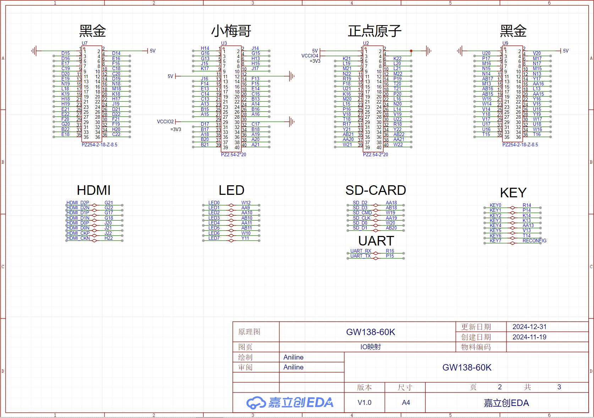

# GW138_60K  

## 📖 描述  
**基于Tang Mega 138K / 60K 二次开发的一款FPGA开发板**，在GW138_060A的基础上进行修改。  

## 🔗 参考  
- **[GW138_060A](https://bigpig.ongridea.com/h9wtn0)**：基于Tang Mega 138K/60K二次开发的FPGA开发板  
  

## 🔌 引脚定义  
  

## 🎮 测试外设  
| **外设模块** | **说明/链接** |  
|--------------|--------------|  
| **多路LED IO测试模块** | [大猪蹄子博客](https://bigpig.ongridea.com/kl43wg) |  
| **正点/黑金/小梅哥转接板** | [外设适配指南](https://bigpig.ongridea.com/wai-she-1-hei-jin) |  
| **LTC2220_12Bit_170M_ADC** | 12位170M采样率ADC |  
| **AD9744_14Bit_210M_DAC** | 14位210M输出率DAC |  

## 🖥️ 软件版本  
- **GOWIN FPGA Designer**: V1.9.10.03  

## ❓ 常见问题  
| **问题** | **解决方案** |  
|----------|--------------|  
| **1. 为什么下载的代码不能直接烧录？** | 因为综合生成的临时文件夹未同步到GitHub，需用户克隆后自行编译生成下载文件 |  
| **2. 为什么综合报错？** |   - 部分工程使用SV语法或复用IO口：      ▸ 在 **Project → Configuration → Place&Route** 中勾选报错的复用IO选项；      ▸ 或在 **Synthesize → General** 中选择 **SystemVerilog2017**。 |  

## 🌟 感谢  
- [大猪蹄子的个人博客](https://bigpig.ongridea.com/)（提供开发板设计和外设适配资源）  

## 🚀 扩展程序  
| **项目名称** | **链接** | **说明** |  
|--------------|----------|----------|  
| **Gowin-138K-OC8051** | [GitHub](https://github.com/Aniline47/GOWIN-138K-OC8051) | 在Gowin 138K上实现8051内核的移植与开发 |  